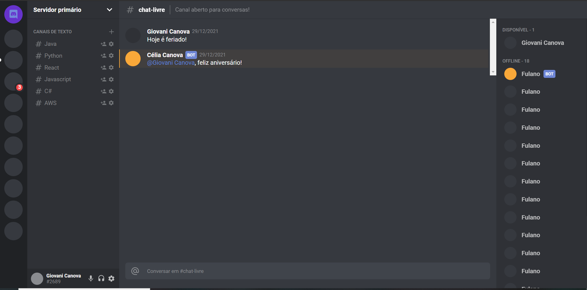

# Recriando a interface de um servidor no Discord

<p align="center">
    
</p>


<p align="center">
    
</p>

# Tecnologias

- [ReactJS](https://pt-br.reactjs.org/)
- [Styled Components](https://styled-components.com/)
- [TypeScript](https://www.typescriptlang.org/)

---

# Como baixar:

```
    $ git clone https://github.com/Giovani2912/Interface-Twitter

    $ cd Interface-Twitter

# Caso esteja utilizando o npm

    $ npm install

    $ npm start

# Caso esteja utilizando o yarn

    $ yarn add

    $ yarn start

```